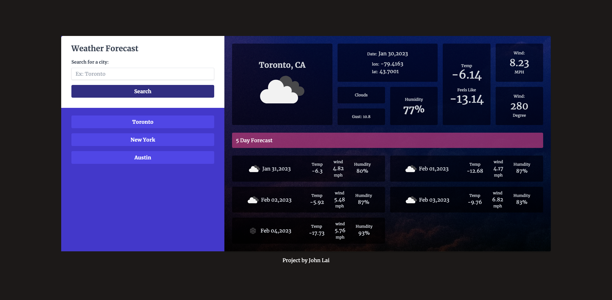

# Weather Forecast App
# User Story
* As a traveler I want to see the weather outlook for multiple cities so that I can plan a trip accordingly.

# Description
* This is a weather forecast app, this project fetches weather data from the open weather map api (api.openweathermap.org). It provides current day and 5 days forcast! The search history its stored in the local storage.

* This project uses tailwind css, google font and day js
* Enjoy!

# Screenshot

# Live Site
https://johnxlai.github.io/weather-dashboard/
